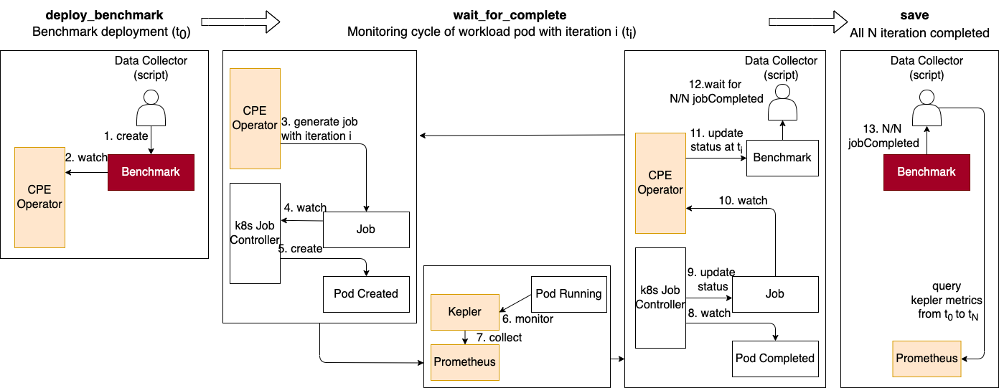

# Contribute to power profiling

## Requirements
- git > 2.22
- kubectl
- python 3.8 with required modules in `./tool/requirement.txt`
- jq, md5sum, pidof
- port 30090 not being used (will be used in port-forward)

## Pre-step
1. Prepare Cluster
2. Deploy Prometheus
3. Deploy Kepler with ServiceMonitor
   
## Run benchmark and collect metric
1. Fork and clone this repository and move to profile folder
    ```bash
    git clone
    cd src/profile
    chmod +x script.sh
    ```
2. Confirm that there is no workload running
    ```bash
    export WORKLOAD_NAMESPACE=<workload-namespaces> # default value: "default"
    ./script.sh check_workload
    ```
    > No workload is running in default. Ready to run benchmark

    If there are some worklaods running in workload namespace, please clean up
3. Run the script
    ```bash
    ./script.sh run
    ```
    The script will
    1. deploy CPE operator
    2. deploy benchmark
    3. wait for benchmark to be completed
    4. forward prometheus server and save response query of kepler metrics
    5. clean up CPE and benchmark

    

    Output will be saved and commit by git in your local.
4. Check git commit, push to your remote, and make a PR
   ```bash
   git log 
   ./script.sh push
   ```

## Choice of benchmarking workload
The default benchmarking workload is [coremark](./tool/benchmark.yaml). Other example benchmarks are as below.

Benchmark Name| Example
|---|---|
Coremark|[Full](./tool/config/full/cpe_coremark.yaml), [Quick](./tool/config/quick/cpe_coremark.yaml)
PARSEC|[Full](./tool/config/full/cpe_parsec.yaml), [Quick](./tool/config/quick/cpe_parsec.yaml)
Stressng|[Full](./tool/config/full/cpe_stressng.yaml), [Quick](./tool/config/quick/cpe_stressng.yaml)
