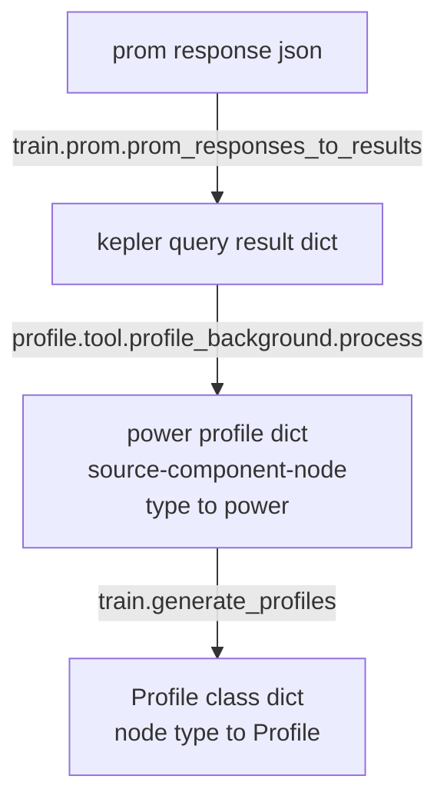

From query to profile

```mermaid
graph TD;
A[prom response json] -->|train.prom.prom_responses_to_results| B[kepler query result dict];
B -->|profile.tool.profile_background.process| C[power profile dict\n source-component-node type to power];
C -->|train.generate_profiles| D[Profile class dict\n node type to Profile]

```